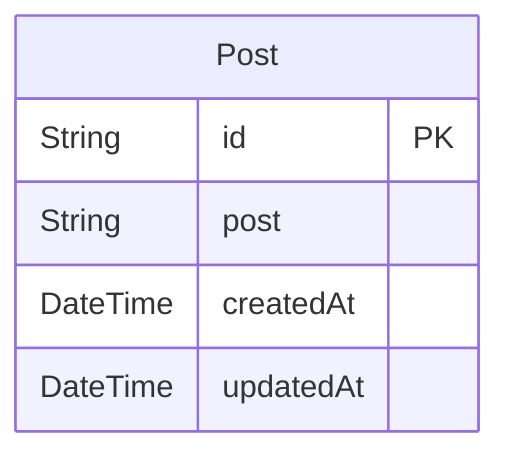

# Prisma Markdown
> Generated by [`prisma-markdown`](https://github.com/samchon/prisma-markdown)

- [default](#default)

## default

### `Post`

**Properties**
  - `id`: ポストの一意のID
  - `post`: ポストの内容
  - `createdAt`: ポストが作成された日時
  - `updatedAt`: ポストが最後に更新された日時